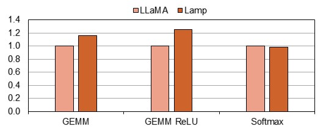
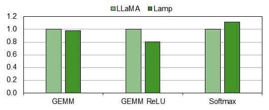
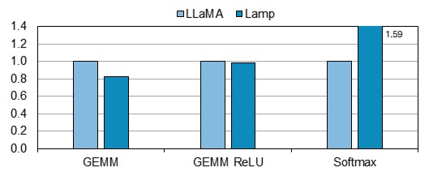

# 💡Lamp
<div style="display:flex; flex-direction:row;">
   
   
       
   
  
</div>

## Project Overview

Welcome to the Optimus GPrime Capstone Design Project! This GitHub repository contains the code and instructions for setting up and running simulations with Lamp.

Lamp is an LLM hardware performance estimator that includes LLM kernels and an evaluator for launching GPU simulations. For detailed information, refer to the instructions below.

## Clone and Build GPGPU-Sim

This project relies on the cycle-accurate GPU simulator, GPGPU-Sim. Before using the LLM_Evaluator, please set up GPGPU-Sim by following the instructions below.

### 1. Clone GPGPU-Sim.

Clone the simulator source code inside the Lamp directory.

```bash
$ cd Lamp
$ git clone https://github.com/gpgpu-sim/gpgpu-sim_distribution
$ mv gpgpu-sim_distribution GPGPU-Sim
```

### 2. Set CUDA installation path.

Check your CUDA installation path and set the PATH variable with the CUDA_INSTALL_PATH.

```bash
$ export CUDA_INSTALL_PATH=<YOUR-CUDA-PATH>
$ export PATH=$PATH:$CUDA_INSTALL_PATH/bin
```

### 3. Build the simulator.

Set up the environment and build the simulator.

```bash
$ cd GPGPU-Sim
$ source setup_environment
$ make -j
```

---

## Run LLM Simulation with Lamp

Once GPGPU-Sim is set up, you can simulate the LLM kernels with our evaluator.

### 1. Set GPU configuration.

There are several GPU configurations inside `/GPGPU-Sim/configs/tested-cfgs`. Choose one and set the CONFIGURE variable in `/LLM_Evaluator/runner`.

### 2. Launch simulation with runner.

Use the runner to launch LLM kernels and wait for the simulation to finish.

```bash
$ cd LLM_Evaluator
$ ./runner
```

### 3. Check the simulation output.

View the simulated output in the `output.log` file located in each kernel's directory.

```bash
$ cd kernel_performance
$ vi SM75_RTX2060/gemm/output.log # Example
```

---

## Summarize LLM Performance with Lamp

Since the runner only launches per-kernel simulations, we need to summarize the simulation results to get the total LLM performance.

### 1. Run summarizer.

Set the GPU configuration in the summarizer and run it.

```bash
$ cd LLM_Evaluator
$ ./summarizer
```

### 2. Check the total LLM performance.

View the total LLM performance in the log file.

```bash
$ vi llm_total_performance_SM75_RTX2060 # Example
```

<a id="evaluation"></a>
## Evaluation
We implemented Lamp using optimization techniques to increase similarity with the existing LLM Kernel.
Consequently, Our Lamp's LLM Kernels that we implemented show more than 80% similarity to existing LLM Kernels. The evaluation results can be checked in the `/evaluation/*Ncu.log`, and the normalized results are displayed graphically as follows.
<p align="center"></p>
The picture above is the result of normalizing the execution time of each kernel of Lamp and LLaMA.
<p align="center"></p>
The picture above is the result of normalizing the memory throughput of each kernel of Lamp and LLaMA.
<p align="center"></p>
The picture above is the result of normalizing the compute throughput of each kernel of Lamp and LLaMA.

---


<a id="acknowledgement"></a>
## 👏 Acknowledgement
This project is enabled by the great projects below.
- [LLaMA](https://github.com/meta-llama/llama)
  
(Below are reference materials for the kernel implementation.)
- [PyTorch](https://github.com/pytorch/pytorch.git) 
- [FasterTransformer](https://github.com/NVIDIA/FasterTransformer.git)
- [CUTLASS](https://github.com/NVIDIA/cutlass.git)
- [SGEMM_CUDA](https://github.com/siboehm/SGEMM_CUDA)
